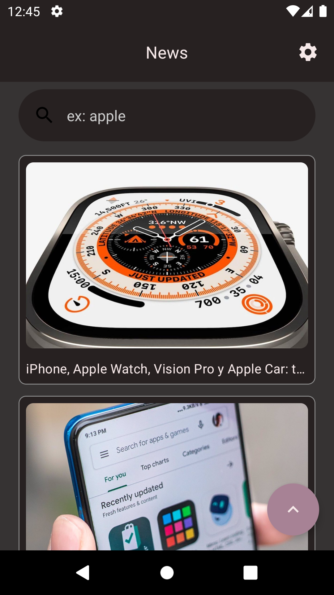
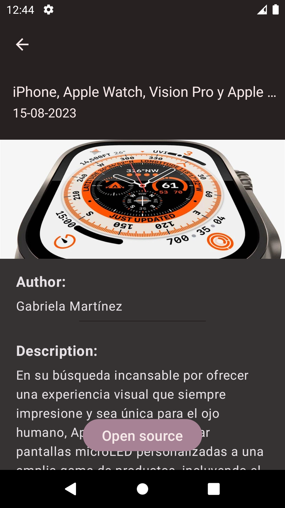
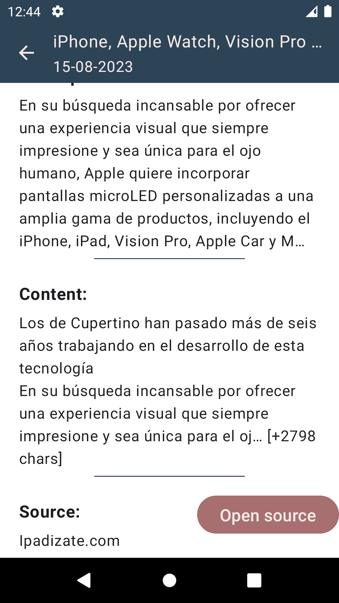
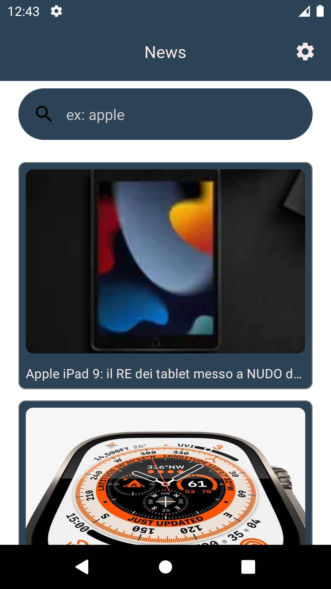
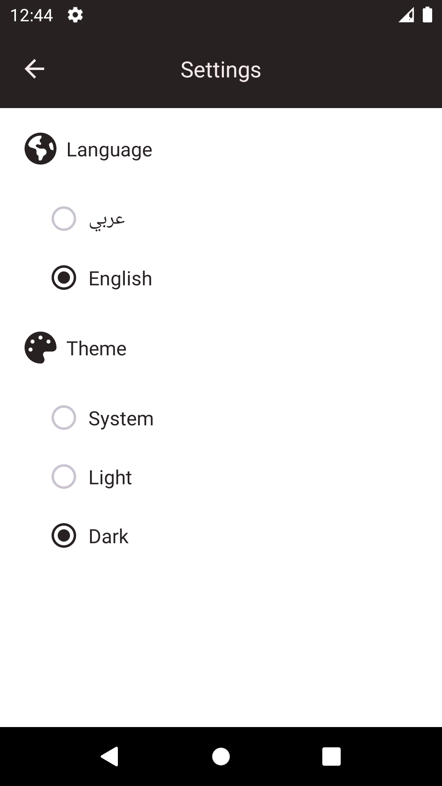
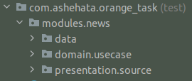

# Orange_task
A task with two screens (news list, news details). When the user selects a row it goes to the next screen.

## ScreenShots:

  
  
  
  
  

## Demo (GIF)

  

## APK Download
[Click here](https://drive.google.com/file/d/1hH8VLKvclu9qMgSkXoNI3Q3oi1u9RIdf/view?usp=sharing)

## In-App architecture

  

## BONUS
- [x] Prefer to use MVI and show the use of design patterns.
- [x] Prefer to Implement using flows & coroutines.
- [ ] ~~Modularization.~~
- [x] Offline caching.
- [x] Apply pagination.
- [x] Dark mode support.
- [x] Arabic localization support.
- [x] Adding unit tests.

## Unit testing for:

  

- News module (data - repository - useCase - source)

## Features
- Caching
- Dark mode support
- Obfuscation
- Simple UI
- Simple Animations
- Config changes handling

## Tools & APIs
- Jetpack Compose
- Compose navigation
- Clean architecture
- MVVM arch pattern (reactive MVI)
- Coroutines & flows
- Retrofit
- Room
- DataStore
- Coil
- Unit testing (Mockito)
- Proguard

